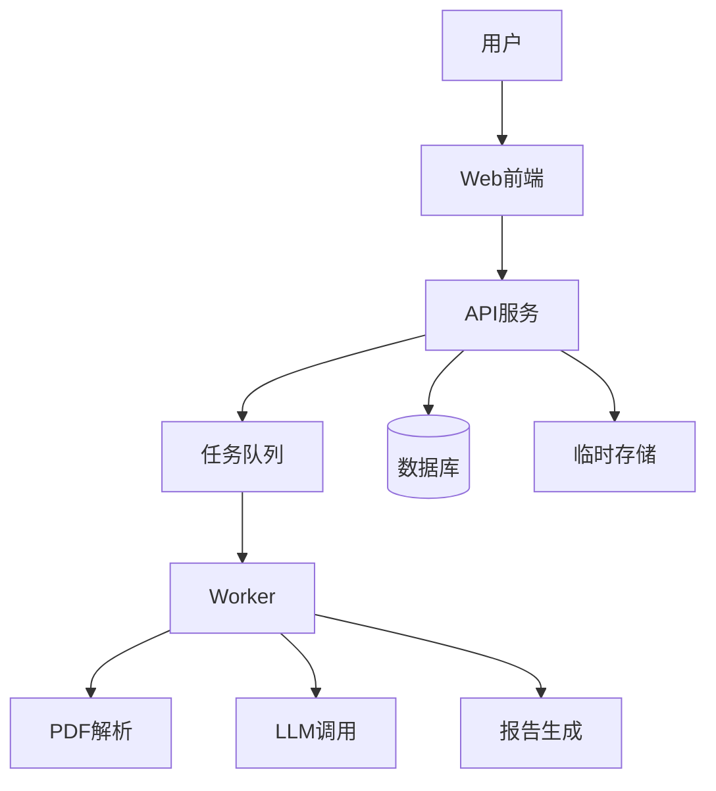

# 技术设计: 高情商AIGC检测器（公开服务）

## 技术方案
### 核心技术
- Web前端: React/Next.js
- 后端API: Python/FastAPI
- 异步队列: Redis + Celery（或等价方案）
- PDF解析: pdfplumber/fitz
- 报告生成: HTML模板 + PDF渲染
- 数据库: PostgreSQL
- 缓存/对象存储: Redis/OSS（临时）

### 实现要点
- 采用前后端分离与异步队列处理PDF与LLM任务
- 对句子评分排序后执行阈值裁剪，确保占比不超过阈值
- 结果页与报告页固定展示免责声明
- 任务完成后立即清理临时文件与中间结果

## 架构设计


## 架构决策 ADR
### ADR-001: 前后端分离+异步队列
**上下文:** 任务耗时不可预测，需保证请求稳定与扩展性。
**决策:** 采用前后端分离与异步队列处理检测任务。
**理由:** 可扩展、易于限流与重试、提升用户体验。
**替代方案:** 单体Web同步处理 → 拒绝原因: 阻塞请求、稳定性差。
**影响:** 增加基础设施成本与部署复杂度。

## API设计
### POST /api/detect
- **请求:** multipart PDF + threshold
- **响应:** taskId, status

### GET /api/detect/{taskId}
- **请求:** taskId
- **响应:** status, summary

### GET /api/report/{taskId}
- **响应:** summary, detail

### GET /api/report/{taskId}/download
- **响应:** PDF文件

## 数据模型
```sql
-- users, detection_tasks, reports, usage_quota
```

## 安全与性能
- **安全:** 文件类型校验、大小限制、任务频率限制、验证码、审计日志
- **性能:** 句子批量判别、队列并发控制、缓存LLM结果

## 测试与部署
- **测试:** 接口测试、端到端流程测试、报告一致性校验
- **部署:** 阿里云部署，域名绑定HTTPS
