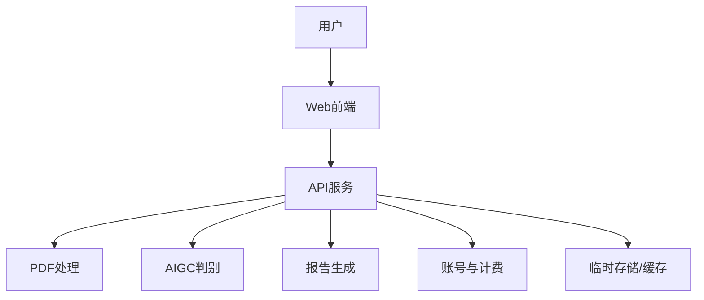
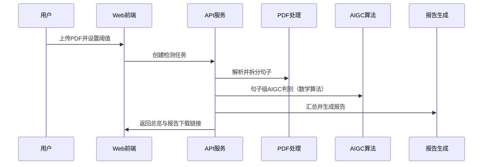

# 架构设计

## 总体架构

## 技术栈
- **后端:** Go (Gin)
- **前端:** React CSR
- **数据:** PostgreSQL + Redis + 临时对象存储
- **邮件通道:** 阿里云 DirectMail（HTTP API）
- **AIGC算法:** 数学算法（占位，后续设计）

## 核心流程

## 重大架构决策
完整的ADR存储在各变更的how.md中，本章节提供索引。

| adr_id | title | date | status | affected_modules | details |
|--------|-------|------|--------|------------------|---------|
| ADR-001 | 认证会话方案（Session Cookie + Redis） | 2026-01-28 | ✅已采纳 | API服务/Web前端 | helloagents/history/2026-01/202601281838_auth_foundation/how.md |
| ADR-002 | 任务队列方案（Redis List + BRPOP） | 2026-01-28 | ✅已采纳 | API服务/任务编排 | helloagents/history/2026-01/202601281951_task_pipeline/how.md |
